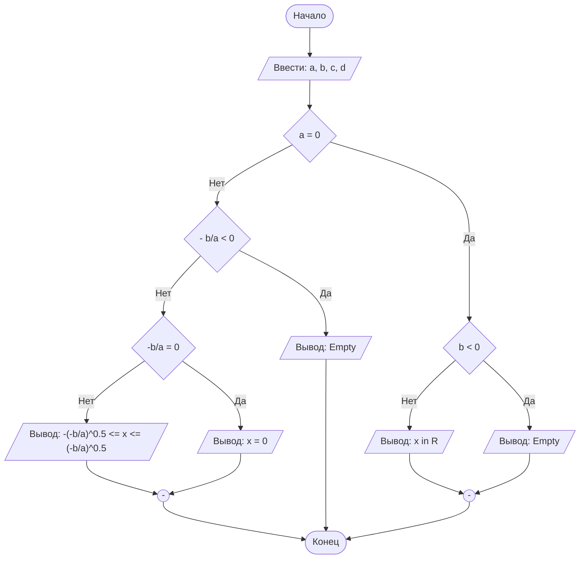

## Cодержание

1. [Отчет по лабораторной работе № 1](#отчет-по-лабораторной-работе--n)
2. [Критерии оценивания](#критерии-оценивания)

## Отчет по лабораторной работе № 1

#### № группы: `ПМ-2601`

#### Выполнил: `Кормилицин Андрей Иванович`

#### Вариант: `11`

### Cодержание:

- [Постановка задачи](#1-постановка-задачи)
- [Входные и выходные данные](#2-входные-и-выходные-данные)
- [Математическая модель](#25-математическая-модель)
- [Выбор структуры данных](#3-выбор-структуры-данных)
- [Алгоритм](#4-алгоритм)
- [Программа](#5-программа)
- [Анализ правильности решения](#6-анализ-правильности-решения)

### 1. Постановка задачи

- Условия задачи

> На вход программы подаются четыре различных квадрата с длинами сторон A, B, C, D. Определить, сколько можно сложить прямоугольников,
используя хотя бы 2 квадрата без наложений и зазоров. На вход программы подаются натуральные числа A, B, C, D.

- Важные уточнения: 
1)	В этой задаче, если слово «различные» подразумевает, что A, B, C, D не равны между собой попарно, решений не будет.
   Рассмотрим все варианты:  
&nbsp;&nbsp;&nbsp;&nbsp;Берем 2 неравных квадрата. Чтобы составить прямоугольник из двух квадратов, их стороны должны быть равны. Если квадраты не равны между собой, следовательно, их стороны также различны. Значит это невозможно.  
&nbsp;&nbsp;&nbsp;&nbsp;Берем 3 неравных квадрата. Чтобы составить прямоугольник из трех квадратов, нужно чтобы или стороны хотя бы двух из них в сумме были равны стороне третьего квадрата или все три квадрата должны быть равны, а это по условие не так, следовательно, решений нет.  
&nbsp;&nbsp;&nbsp;&nbsp;Берем 4 неравных квадрата. Так как все 4 стороны различны, то квадрат из них составить нельзя.  
3) Будем считать, что расположение квадратов и их порядок расстановки не важен: 

- Для нахождения количества прямоугольников нужно проверить 4 случая:
  1. Если A, B, C, D равны, то существует два варианта их расположения: 1x4, 2x2.
  2. Если три стороны равны, а четвертая равна сумме этих трех сторон.
  3. Если среди 4 сторон есть 2 пары равных сторон таких, что сумма одной пары в два раза больше суммы другой пары.
  4. Если есть пара равных сторон, третья сторона равна сумме равных сторон, а четвертая в 3 раза больше наименьшей стороны.
   
### 2. Входные и выходные данные
На вход подаются 4 натуральных числа - стороны квадратов. Минимальное значение - 1 (так как сказано что числа натуральные), верхняя граница не дана, так что будем считать, что она равна 10<sup>9</sup>:
|             | Тип                | min значение    | max значение   |
|-------------|--------------------|-----------------|----------------|
| A (Число 1) | Натуральное число  | 1               | 10<sup>9</sup> |
| B (Число 2) | Натуральное число  | 1               | 10<sup>9</sup> |
| C (Число 3) | Натуральное число  | 1               | 10<sup>9</sup> |
| D (Число 4) | Натуральное число  | 1               | 10<sup>9</sup> |


### 2,1. Данные на выход
Так как программа должна вывести количество прямоугольников которых можно получить в результате объединения квадратов, то на выход мы получим единственное целое неотрицательное число (причем это число не будет превышать 12, так как 12 - максимальное количество прямоугольников, которых мы можем получить объединяя от 2 до 4 квадратов разными способами) Назовем эту переменную - k, в ней будет храниться число - количество возможных прямоугольников:
|             | Тип                                | min значение | max значение   |
|-------------|------------------------------------|--------------|----------------|
| K (Число 1) | Целое неотрицательное число        | 0            | 12             |


### 2,5. Математическая модель
Пусть даны стороны четырех квадратов A, B, C, D. Рассмотрим все подмножества мощности от 2 до 4. Проверим, возможно ли получить прямоугольник из этих подмножеств. Если возможно, то сколькими способами.

Для 2 квадратов: если их стороны равны. Количество вариантов: 1.  

Для 3 квадратов возможны 2 случая:  
1. Если их стороны равны. Количество вариантов: 1.  
2. Если два квадрата равны, а третий в 2 раза больше первого в 2 раза. Количество вариантов: 1.

Для 4 квадратов возможны 4 случая:  
1. Если их стороны равны. Ответ: a * 4a - прямоугольник. Количество вариантов: 2.  
2. Сумма трех равных сторон квадратов равна стороне четвертого квадрата. Количество вариантов: 1.  
3. Если есть две пары равных сторон, таких что сумма сторон одной пары в два раза больше суммы сторон во второй паре. Количество вариантов: 1.  
4. Пусть первая сторона - x, тогда вторая - x, третья - 2x, четвертая - 3x. Количество вариантов: 1.  
### 3. Выбор структуры данных

Программа получает 4 натуральных числа, не превышающих 10<sup>9</sup> < 2<sup>30</sup>. Поэтому для их хранения
можно выделить 4 переменных (`a`, `b`, `c`, `d`) типа `double`. Также требуется дополнительная переменная (`k`) типа `int` для хранения количества возможных прямоугольников, которая будет принимать значения от 0 до 12.

|             | название переменной | Тип (в Java) | 
|-------------|---------------------|--------------|
| A (Число 1) | `a`                 | `double`     |
| B (Число 2) | `b`                 | `double`     | 
| C (Число 3) | `c`                 | `double`     |
| D (Число 4) | `d`                 | `double`     | 
| K (Число 6) | `k`                 | `int`        | 
### 4. Алгоритм

На русском языке подробно расписать, что и в каком порядке делает Ваша программа.

В 1 лабораторной работе блок-схем обязательна. Ниже представлен пример с лекции,
реализованный с помощью `mermaid` - инструментом для рисования диаграмм и блок-схем.

```markdown
    ```mermaid
        ([Начало]) --> B[/Ввести: a, b, x/]
        B --> C{a = 0}
        C -- Нет --> D{- b/a < 0}
        D -- Нет --> E{"-b/a = 0"}
        E -- Нет --> F[/"Вывод: -(-b/a)^0.5 <= x <= (-b/a)^0.5"/]
        E -- Да --> G[/Вывод: x = 0/]
        D -- Да --> H[/Вывод: Empty/]
        C -- Да --> I{b < 0}
        I -- Нет --> J[/Вывод: x in R/]
        I -- Да --> K[/Вывод: Empty/]
        J --> M(("-"))
        K --> M
        G --> L(("-"))
        H ----> Z
        F --> L
        M --> Z
        L --> Z([Конец])
    ``` 
```





### 5. Программа

Полный текст программы с комментариями на русском языке

Нужно вставить код прямо в отчет в блок:

```markdown
    ```java
        class Main{
            // Что-то далее
        }
    ``` 
```

Это будет выглядеть следующим образом:

```java
class Main{
    // Что-то далее
}
```

### 6. Анализ правильности решения

Привести тесты и анализ работы программы для этих тестов.
Очень неплохо было бы обосновать выбор тестов.

1. Тест на что-то

- Input:
    ```
    1
    1
    ```

- Output:
    ```
    2
    ```

2. Тест на что-то еще

- Input:
    ```
    1
    -1
    ```

- Output:
    ```
    0
    ```

# Критерии оценивания

Обратите внимание на то, что лабораторная работа должна быть выложена в отдельный репозиторий с названием LabN (N -
Номер лабы). В репозитории должно быть минимум 2 файла (README.md - отчет, Main.java - код лабы)

| **Критерий**                                                                                                                                                                           | **Баллы**       |
|----------------------------------------------------------------------------------------------------------------------------------------------------------------------------------------|-----------------|
| **Корректность программы**                                                                                                                                                             | **0** - **40**  |
| - Программа полностью выполняет задачу                                                                                                                                                 | 15              |
| - Нет ошибок выполнения                                                                                                                                                                | 10              |
| - Учтены все ограничения                                                                                                                                                               | 5               |
| - Правильное поведение в "крайних" случаях                                                                                                                                             | 10              |
|                                                                                                                                                                                        |                 |
| **Оптимизация кода**                                                                                                                                                                   | **0** - **20**  |
| - Эффективные алгоритмы                                                                                                                                                                | 10              |
| - Избежание избыточности и повторов                                                                                                                                                    | 5               |
| - Разумность использования структур данных                                                                                                                                             | 5               |
|                                                                                                                                                                                        |                 |
| **Читабельность и стиль кода**                                                                                                                                                         | **0** - **20**  |
| - Соблюдение стандартов форматирования                                                                                                                                                 | 5               |
| - Наличие комментариев, в полном объеме поясняющих написанный код                                                                                                                      | 10              |
| - Понятные имена переменных и функций                                                                                                                                                  | 5               |
|                                                                                                                                                                                        |                 |
| **Оформление отчета**                                                                                                                                                                  | **0** - **20**  |
| - Соблюдение структуры отчета                                                                                                                                                          | 5               |
| - Отчет загружен на GitHub в репозиторий с названием LabN (N - номер лабораторной работы), отчет в формате Markdown с названием README.md, также есть файл Main.java с кодом программы | Обязательно     |
| - Четкое описание алгоритма (блок-схема если нужна)                                                                                                                                    | 5               |
| - Полнота покрытия тестами всех случаев                                                                                                                                                | 5               |
| - Обоснования использования алгоритма, структур данных                                                                                                                                 | 5               |
|                                                                                                                                                                                        |                 |
| **Общая сумма**                                                                                                                                                                        | **0** - **100** |
